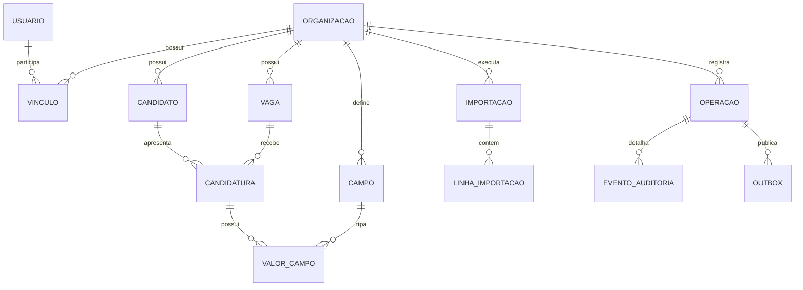

# Modelo de dados

## Entidades e responsabilidades

| Entidade | Responsabilidade |
| --- | --- |
| Organização | Fronteira de dados, nome, fuso e versão de esquema |
| Usuário/vínculo | Identidade OIDC e papel ativo por organização |
| Candidato | Pessoa, nome e contatos compartilhados |
| Vaga | Oportunidade a que a candidatura se refere |
| Candidatura | Participação do candidato na vaga, versão e exclusão lógica |
| Campo configurável | Tipo, rótulo, regras, padrão, opções e arquivamento |
| Valor de campo | Valor tipado associado à candidatura e definição |
| Identificador externo | Identidade por organização, origem e tipo de entidade |
| Importação/linha | Arquivo temporário, mapeamento, validação, operação e resultado |
| Operação/evento de auditoria | Autor/ação/origem/correlação e alteração por entidade/campo |
| Outbox | Publicação de invalidações após commit |
| Registro de eliminações | IDs necessários para reaplicar eliminações após recuperação |

## JSONB, atributo–valor e híbrido

JSONB por candidatura é flexível e simples para ler a linha, mas ordenações tipadas, referências e mudanças de regras exigem controles e índices específicos. GIN não resolve todas as consultas/ordenações. [PostgreSQL JSONB](https://www.postgresql.org/docs/17/datatype-json.html).

Atributo–valor genérico em texto amplia flexibilidade às custas de integridade e filtros numéricos/temporais. O **híbrido adotado** combina entidades relacionais, valores com colunas tipadas, associações para seleção múltipla e JSONB para definições. CHECKs e triggers impedem misturar tipos; FKs validam opções e responsáveis. Ausência de linha significa valor ausente; `false` e `0` permanecem valores.

## Índices e filtros

Referências de domínio incluem organização e ID. Índices parciais cobrem candidaturas ativas, vaga e ordem padrão; candidatos têm índices de e-mail/telefone. Valores são indexados por organização/campo/valor/candidatura; seleções múltiplas por opção. Auditoria tem índices de entidade, operação e data. Outbox indexa pendências.

Consultas validam campos e operadores antes de compilar SQL parametrizado. Filtros são AND; ordenações usam desempate por ID e nulos ao final. Paginação é por página com máximo de 200 linhas. Consultas profundas e muitos filtros dinâmicos precisam de medição antes de ampliar limites. RLS é defesa adicional à autorização HTTP e usa contexto transacional para evitar vazamento pelo pool.
